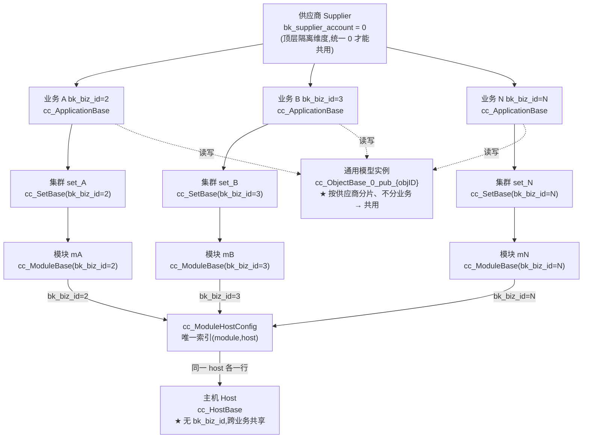
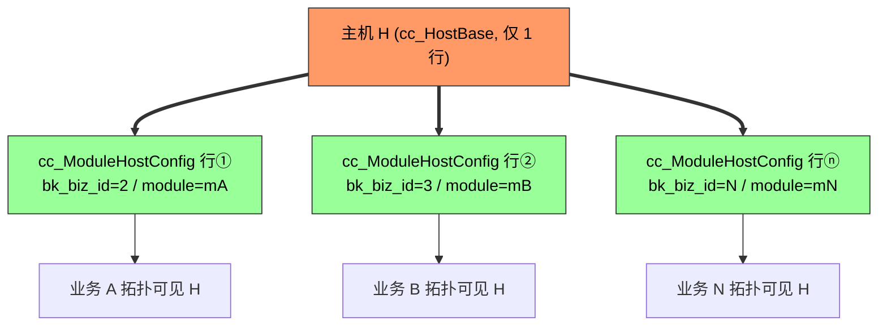

# bk-cmdb host 实例 / 模型描述 / 属性描述 涉及表分析（含双业务共享主机与交换机推演）

> 版本: release-v3.10.41
> 核心结论:
> 1. **host 实例只存在于 `cc_HostBase` 一张表**,绝对不会落到通用 Object 实例分片表 `cc_ObjectBase_{supplier}_pub_host`。模型描述在 `cc_ObjDes`、属性描述在 `cc_ObjAttDes`(两张表是所有模型共用的"字典表",靠 `bk_obj_id="host"` 区分)。
> 2. 在**单一供应商("0")**下,一台 host 可借 `cc_ModuleHostConfig` 关系行同时"存在于"多个业务拓扑(双业务/多业务共享主机);交换机等通用模型实例按供应商分片、跨业务共用。

---

## 1. 结论先行

| 问题 | 结论 |
| --- | --- |
| host 实例存在几张表? | **仅 1 张**: `cc_HostBase`(主线条专用表) |
| 是否也存在于通用 Object inst 表 `cc_ObjectBase_{supplier}_pub_host`? | **否**。该表根本不会被创建/写入(见 §3) |
| host 模型描述在哪? | `cc_ObjDes`(`bk_obj_id="host"`) |
| host 属性描述在哪? | `cc_ObjAttDes`(`bk_obj_id="host"`) |
| 与 host 相关的"链路/挂载"表有哪些? | `cc_ModuleHostConfig`、`cc_PlatBase`、`cc_Process`、`cc_ServiceInstance`、`cc_ProcessInstanceRelation`、`cc_HostApplyRule`、`cc_HostFavourite`、`cc_HostLock` |
| 一台 host 能否同时"存在于"多个业务? | **能**(单供应商下)。由 `cc_ModuleHostConfig` 中带几个不同 `bk_biz_id` 的关系行决定(见 §5) |
| 交换机能否同样跨多业务? | **能**。靠"集群关联交换机"产生的 `cc_InstAsst` 关联行(每行带 `bk_biz_id`,见 §6) |

> 容易把"host 实例"和"host 在主线拓扑中的挂载关系"混淆。host 实例本体(`bk_host_id` 及其全部属性)只在 `cc_HostBase`;它与模块、云区域的**关系**分别在 `cc_ModuleHostConfig` 与 `cc_PlatBase` 中,这些不是实例主表。

---

## 2. 涉及表清单

### 2.1 三类核心表(回答本题)

| 类别 | 表名(常量) | 源码常量 | 作用 | 是否共用 |
| --- | --- | --- | --- | --- |
| host 实例 | `cc_HostBase` | `BKTableNameBaseHost` | 存放主机实例本体(`bk_host_id`、`bk_host_innerip`、`bk_host_outerip`、`bk_cloud_id`、`bk_asset_id`、`bk_os_*` 等全部主机属性) | **仅 host 专用** |
| host 模型描述 | `cc_ObjDes` | `BKTableNameObjDes` | 模型元信息(`bk_obj_id="host"`、`bk_obj_name`、`bk_classification_id`、`bk_supplier_account`、`bk_ispaused` 等) | **所有模型共用**,按 `bk_obj_id` 区分 |
| host 属性描述 | `cc_ObjAttDes` | `BKTableNameObjAttDes` | 属性元信息(`bk_obj_id="host"`、`bk_property_id`、`bk_property_name`、`bk_property_type`、`bk_property_group`、`bk_isapi` 等) | **所有模型共用**,按 `bk_obj_id` 区分 |

三张表的常量定义位置: `src/common/tablenames.go:35/29/46`

```go
BKTableNameObjDes    = "cc_ObjDes"      // L29 模型描述
BKTableNameObjAttDes = "cc_ObjAttDes"   // L35 属性描述
BKTableNameBaseHost  = "cc_HostBase"    // L46 host 实例
```

### 2.2 host 实例相关的"链路/挂载"表(非实例本体,但常被误认)

| 表名(常量) | 源码常量 | 作用 | 与 host 的关系 |
| --- | --- | --- | --- |
| `cc_ModuleHostConfig` | `BKTableNameModuleHostConfig` | 主机↔模块挂载关系表 | 记录 `bk_host_id` + `bk_module_id` + `bk_supplier_account`,一条主机可挂多模块 |
| `cc_PlatBase` | `BKTableNameBasePlat` | 云区域(管控区域)表 | `cc_HostBase.bk_cloud_id` 外键指向此表的 `bk_cloud_id` |
| `cc_Process` | `BKTableNameBaseProcess` | 进程实例表 | 进程挂载在主机上(`bk_host_id`) |
| `cc_ServiceInstance` | `BKTableNameServiceInstance` | 服务实例 | 服务实例绑定主机(`bk_host_id`) |
| `cc_ProcessInstanceRelation` | `BKTableNameProcessInstanceRelation` | 进程实例关系 | 关联进程与主机/模块/服务实例 |
| `cc_HostApplyRule` | `BKTableNameHostApplyRule` | 主机属性自动应用规则 | 基于主机属性做自动赋值 |
| `cc_HostFavourite` | `BKTableNameHostFavorite` | 主机收藏 | 用户收藏的主机列表 |
| `cc_HostLock` | `BKTableNameHostLock` | 主机锁 | 防止并发操作同一主机 |

> 注意: 上表里的 `cc_Process`、`cc_PlatBase` 也是主线条"专用 Base 表",与 `cc_HostBase` 同属内建对象(`BKInnerObjIDProc="proc"`、`BKInnerObjIDPlat="plat"`),同样**不进**通用分片表。

---

## 3. 为什么 host 实例不在通用 Object inst 表

### 3.1 内建对象走专用表,自定义对象才走分片表

路由核心在 `src/common/tablenames.go:214` 的 `GetInstTableName`:

```go
func GetInstTableName(objID, supplierAccount string) string {
    switch objID {
    case BKInnerObjIDApp:    return BKTableNameBaseApp      // cc_ApplicationBase
    case BKInnerObjIDBizSet: return BKTableNameBaseBizSet   // cc_BizSetBase
    case BKInnerObjIDSet:    return BKTableNameBaseSet      // cc_SetBase
    case BKInnerObjIDModule: return BKTableNameBaseModule   // cc_ModuleBase
    case BKInnerObjIDHost:   return BKTableNameBaseHost     // ★ cc_HostBase
    case BKInnerObjIDProc:   return BKTableNameBaseProcess  // cc_Process
    case BKInnerObjIDPlat:   return BKTableNameBasePlat     // cc_PlatBase
    default:
        return GetObjectInstTableName(objID, supplierAccount) // cc_ObjectBase_{supplier}_pub_{objID}
    }
}
```

- `host` 命中 `case BKInnerObjIDHost`(常量 `BKInnerObjIDHost = "host"`,定义于 `src/common/definitions.go:113`),直接返回 `cc_HostBase`。
- 只有落到 `default` 分支时,才会生成 `cc_ObjectBase_{supplier}_pub_{objID}` 这种**通用分片表**。host 永远不会进入该分支。
- 全代码库检索 `pub_host` / `GetObjectInstTableName(...host)` **零命中**,证明没有任何逻辑会把 host 实例写入通用分片表。

### 3.2 通用分片表只在"新建自定义模型"时创建

通用实例分片表由 `createObjectShardingTables`(`src/source_controller/coreservice/core/model/model_crud.go:188`)创建,仅由 `CreateModelTables`(`model_tables.go:22`)调用,而 `CreateModelTables` 只在**新增自定义模型**流程中触发。

host 是**内建主线条模型**,在系统初始化时注册(走 `cc_ObjDes` 内建数据 + 专用 `cc_HostBase` 表),**不**经过"新建模型"流程,因此:
- 不存在 `cc_ObjectBase_0_pub_host` 这张表;
- 即便手工在 `cc_ObjDes` 里看到 `bk_obj_id="host"`,它的实例也始终读写 `cc_HostBase`。

### 3.3 host 在代码里被"特殊对待"的证据

`src/storage/dal/mongo/local/mongo.go` 对 `cc_HostBase` 有专门分支:

- `tryArchiveDeletedDoc`(L634-657): `case common.BKTableNameBaseHost:` 被纳入软删除归档白名单(host 删除时写 `cc_DelArchive`)。
- `validHostType`(L1184-1193): 仅当 `collection == BKTableNameBaseHost` 时,把主机特殊字段(`bk_host_innerip`/`bk_host_outerip` 等数组 ↔ 字符串)做转换——这种定制逻辑也反向证明 host 是独立表,而非走通用实例表。

---

## 4. host 实例与主线拓扑的关系(为什么容易误以为它在别的表)

### 4.1 主线拓扑链

主线拓扑链: **业务(biz) → 集群(set) → 模块(module) → 主机(host)**。

- `biz/set/module` 通过实例上的 `bk_parent_id` 字段逐级挂载(存在于各自的 Base 表)。
- `host` 是**叶子节点**,它**不通过 `bk_parent_id` 挂到 module**,而是通过 `cc_ModuleHostConfig`(主机-模块关系表)挂载。
- `cc_HostBase` 中的 `bk_cloud_id` 通过 `cc_PlatBase` 关联云区域。

所以一份完整的"主机"数据 = `cc_HostBase`(本体) + `cc_ModuleHostConfig`(挂哪些模块) + `cc_PlatBase`(在哪个云区域)。三者都是独立表,**主机实例本体只有 `cc_HostBase` 一份**。

### 4.2 业务拓扑-模块视图的主机列表,拼接了哪些其他列?

进入"业务拓扑"点击某模块,右侧主机列表并不是只展示 `cc_HostBase` 的字段,而是由 **`host_server` 的 `SearchHost` 流程**(`src/scene_server/host_server/logics/hostsearch.go`)在返回时**额外 join 了主线拓扑的列**。核心函数链路:

```
SearchHost (hostsearch.go:33)
  ├─ SearchHostByConds   → 按拓扑/主机条件初筛 hostID
  └─ FillTopologyData    → 把拓扑列拼回每一行 (hostsearch.go:209)
       ├─ GetHostRelations → 读 cc_ModuleHostConfig,取 bk_app_id / bk_set_id / bk_module_id / bk_host_id
       ├─ fetchTopoAppCacheInfo    → 读 cc_ApplicationBase (业务)
       ├─ fetchTopoSetCacheInfo    → 读 cc_SetBase          (集群/set)
       ├─ fetchTopoModuleCacheInfo → 读 cc_ModuleBase       (模块)
       └─ fetchHostCloudCacheInfo  → 读 cc_PlatBase         (云区域)
```

最终每一行返回的是一个 map,键为各对象 ID,值里**额外拼接**的拓扑列如下:

| 拼接键 | 来源表 | 拼接进来的属性列 | 说明 |
| --- | --- | --- | --- |
| `host`(值本身) | `cc_HostBase` | `bk_host_id`、`bk_host_innerip`、`bk_host_outerip`、`bk_asset_id`、`bk_os_*` 等全部主机属性 | 主机本体;其中 `bk_cloud_id` 被改写为 `[{bk_inst_id, bk_inst_name, bk_obj_id:"plat"}]` 结构(见下) |
| `bk_biz` | `cc_ApplicationBase` | `bk_biz_id`、`bk_biz_name` | 业务列;一台主机可属于多个业务时返回数组 |
| `bk_set` | `cc_SetBase` | `bk_set_id`、`bk_set_name`(可加 `bk_set_template_id` 等) | 集群/set 列;额外写入合成字段 `TopSetName = "业务名##集群名"` |
| `bk_module` | `cc_ModuleBase` | `bk_module_id`、`bk_module_name`(可加 `bk_service_template_id` 等) | 模块列;额外写入合成字段 `TopModuleName = "业务名##集群名##模块名"` |
| `host.bk_cloud_id` | `cc_PlatBase` | `bk_cloud_id` + `bk_cloud_name` | 云区域:由 `fillHostCloudInfo` 把 `bk_cloud_id` 关联 `cc_PlatBase` 的 `bk_cloud_name`,转成 `InstNameAsst` 数组挂回 host |

> 关键代码点:
> - 关系来源 `cc_ModuleHostConfig`(`FillTopologyData` L215-217 固定 `Fields: bk_app_id / bk_set_id / bk_module_id / bk_host_id`)。
> - 拼接合成链 `TopSetName`/`TopModuleName`(`hostsearch.go:411`、`443`,分隔符常量 `SplitFlag = "##"`)。
> - 云区域改写 `fillHostCloudInfo`(`hostsearch.go:303`),`bk_cloud_name` 取自 `cc_PlatBase`。

### 4.3 拼接规则小结

- **"其他列"都来自主机本体之外的 4 张表**:`cc_ApplicationBase`(业务)、`cc_SetBase`(集群)、`cc_ModuleBase`(模块)、`cc_PlatBase`(云区域),外加关系表 `cc_ModuleHostConfig` 提供的挂载 ID。
- 这些列**不是** host 实例表 `cc_HostBase` 的字段,而是查询期**联表拼接(join)**出来的展示列,后台返回的每个主机对象是一个 `{host, bk_biz, bk_set, bk_module}` 的嵌套结构。
- 一台主机可同时挂在多个模块/集群/业务下,因此 `bk_set`、`bk_module`、`bk_biz` 都是**数组**,前端再按需展开成「业务 / 集群 / 模块」列展示。
- 由此也能再次印证:**主机实例本体永远只有 `cc_HostBase` 一份**,业务拓扑里看到的「集群」「模块」等列只是基于 `cc_ModuleHostConfig` 关系做的联表展示,并不在 host 实例表里多存一份。

---

## 5. 双业务拓扑共享主机 / host 存在于 n 个业务(推演)

> 需求: 基于**一个 cmdb**(一个 MongoDB),存在**两套(多套)业务拓扑**,每套有独立**集群关联/模块关联**;多套拓扑能**同时读写数量一致的主机(host)**,且**资源通用模型实例共用**。
> 结论: **无需改代码,标准"单供应商 + 多业务"模型即可满足**。关键约束是必须使用**同一个供应商账户(`bk_supplier_account="0"`)**。

### 5.1 需求映射与可行性结论

| 需求点 | 对应的 cmdb 源码概念 |
| --- | --- |
| 一个 cmdb | 一个 MongoDB 实例、一个 `bk_supplier_account`(默认 `"0"`) |
| 两套业务拓扑 | 两个业务 `bk_biz_id`(如 2 和 3),各自由 `cc_SetBase`/`cc_ModuleBase` 构成独立主线 |
| 两套集群关联/模块关联 | 两套 `cc_ModuleHostConfig` 关系行(各自带 `bk_biz_id`) |
| 同时读写一致数量的 host | 同一批 `bk_host_id` 在两套拓扑的模块下各有一行 `cc_ModuleHostConfig` |
| 资源通用模型实例共用 | 自定义模型实例表 `cc_ObjectBase_{supplier}_pub_{objID}` 按**供应商**分片、不按业务分片 |

可行性结论:
1. **数据层无需改代码,但标准 API/前端不支持跨业务共存**: 数据模型(`cc_ModuleHostConfig` 唯一索引不含 `bk_biz_id`)本身允许一台 host 跨业务,直接 DB 注入即可生效;然而 **`hosts/modules` 等标准 API 与前端都拒绝跨业务共存**(入口校验 `validHostsBelongBiz` 报 1199002/1113002,见 §5.6)。要让 host 同时出现在两套拓扑,**必须直接写 `cc_ModuleHostConfig` 或改后端**。
2. **必须满足同一供应商**: 所有业务、所有通用模型实例都用 `bk_supplier_account="0"`。若误用两个 owner,通用模型实例会分到 `cc_ObjectBase_{ownerA}_pub_*` 与 `cc_ObjectBase_{ownerB}_pub_*`,不再共用。
3. **两套拓扑共享 host 的载体是 `cc_ModuleHostConfig`**: 其唯一索引不含 `bk_biz_id`,数据模型上天然允许同一主机跨业务挂载(见 §5.5.3 的 DB 注入方式)。
4. **通用模型实例天然共用**: 自定义模型实例表按供应商分片、不按业务分片,两业务查到的是同一张表同一批数据。

### 5.2 供应商隔离与分片规则(核心事实)

#### 5.2.1 供应商(Supplier / Owner)是顶层隔离维度

- 常量: `BKDefaultOwnerID = "0"`、`BKSuperOwnerID = "superadmin"`(`src/common/definitions.go:74/77`)。
- 查询过滤逻辑 `SetQueryOwner`(`src/common/util/ownerutil.go:20`):
  - owner=`"0"` → 只看 `bk_supplier_account="0"`;
  - owner=`"superadmin"` → 不过滤(看全部);
  - 其他 → 看 `["0", owner]`。

> 含义: 只要所有业务/数据都在**同一个供应商 "0"** 下,数据天然互通;若拆成两个 owner,通用模型实例会落入**不同的分片表**,不再"共用"。这是满足"通用模型实例共用"的**硬前提**。

#### 5.2.2 分片维度是 `supplier`,不是 `bk_biz_id`

实例表路由见 §3.1(`GetInstTableName`): 内建主线对象(biz/set/module/host/proc/plat)走专用 Base 表(单表、无供应商分片维度);自定义(通用)对象走 `cc_ObjectBase_{supplier}_pub_{objID}`(按供应商分片,表名构造见 `tablenames.go:182` `GetObjectInstTableName`)。

| 对象类型 | 表名 | 是否按供应商分片 |
| --- | --- | --- |
| 内建主线对象 biz/set/module/host/proc/plat | `cc_ApplicationBase` / `cc_SetBase` / `cc_ModuleBase` / `cc_HostBase` / `cc_Process` / `cc_PlatBase` | **否**(单表,无供应商维度) |
| 自定义(通用)对象 | `cc_ObjectBase_{supplier}_pub_{objID}` | **是(按供应商)** |

> **关键点**: 分片维度是 `supplier`,**不是 `bk_biz_id`**。因此同一供应商下,所有业务共用同一张 `cc_ObjectBase_0_pub_xxx` —— 即"资源通用模型实例共用"在架构上天然成立。

#### 5.2.3 各 Base 表的字段维度

索引定义(`src/common/index/collections/*`)确认各表带有的维度字段:

| 表 | `bk_supplier_account` | `bk_biz_id` |
| --- | --- | --- |
| `cc_ApplicationBase`(业务) | ✅ | ✅ |
| `cc_SetBase`(集群) | ✅ | ✅ |
| `cc_ModuleBase`(模块) | ✅ | ✅ |
| `cc_HostBase`(主机) | ✅ | **❌ 无** |

> 主机本身**不按业务分片**(无 `bk_biz_id`),它是跨业务的"共享资源",靠关系表挂到各业务模块。

### 5.3 `cc_ModuleHostConfig`:跨业务共享的底层支撑

索引定义(`src/common/index/collections/modulehostconfig.go`):

- 字段: `bk_biz_id`、`bk_set_id`、`bk_module_id`、`bk_host_id`(以及 `bk_supplier_account`)。
- 唯一索引: `idx_unique_moduleID_hostID` = **`(bk_module_id, bk_host_id)`**,**不含 `bk_biz_id`**。

> 这是"两套拓扑共享同一批 host"的底层支撑: 同一台 `bk_host_id` 可以在业务 A 的模块里有一行,同时在业务 B 的模块里有另一行(两行 `(模块,主机)` 各自唯一)。业务拓扑里展示的主机列表,正是按 `bk_biz_id` 过滤 `cc_ModuleHostConfig` 再联表拼出的(见 §4.2 `FillTopologyData`)。

### 5.4 创建业务生成独立主线 + 主机跨业务增量挂载

**创建业务** `CreateBusiness`(`src/scene_server/topo_server/logics/inst/business.go:93`):

1. 写 `cc_ApplicationBase` 一行(`bk_biz_id`);
2. 创建"空闲机池"集群 `set`(`cc_SetBase`,`DefaultResSetFlag`,带 `bk_biz_id`);
3. 在其下创建空闲机/故障机/回收/自定义模块(`cc_ModuleBase`,各带 `bk_biz_id`)。

> 每创建一个业务,就得到一套**带不同 `bk_biz_id` 的独立 set/module 实例树** —— 即"两套业务拓扑"在表层面的体现。

**主机挂接** `TransferToNormalModule`(`src/source_controller/coreservice/core/host/transfer/manager.go:102`):

- 入参 `IsIncrement`: 为 `true` 时做**增量挂载**,不清空目标业务内原有模块关系;
- 语义: **同一业务内**把 host 转移到另一个模块(代码注释 "in the same business")。转移前 `validHostsBelongBiz`(`transfer.go:286`)会校验 host 只能属于目标业务,**因此该 API 无法把一台已在业务 A 的 host 再"叠加"进业务 B**——它拒绝跨业务共存(实测报 `1199002`,见 §5.6.6)。
- 要让同一主机**同时**出现在两套拓扑,唯一可行是**直接 DB 注入 `cc_ModuleHostConfig`**(§5.5.3),绕过 API 校验。

> 数据模型上,`cc_ModuleHostConfig` 唯一索引(模块+主机)不含 `bk_biz_id`,同一主机被两个业务的模块各有一行即为"两套拓扑同时读写同一批 host"——但这只能通过 DB 注入达成,标准 API 做不到。

### 5.5 host 存在于 n 个业务的配置方式

> 一句话:**host 在几个业务里"存在",完全由 `cc_ModuleHostConfig` 里带几个不同 `bk_biz_id` 的关系行决定**。host 本体(`cc_HostBase`)只有一份、没有 `bk_biz_id`;它"属于哪些业务"是关系派生出来的,不是字段写死的。

#### 5.5.1 底层数据模型

| 表 | 角色 | 与"n 个业务"的关系 |
| --- | --- | --- |
| `cc_HostBase` | host 本体 | 1 行/台(host 无 `bk_biz_id`,跨业务共享) |
| `cc_ModuleHostConfig` | host↔模块关系 | **每挂到一个业务的模块,就多 1 行**;同一 host 在 n 个业务各有 1 行 → 该 host 就"存在于 n 个业务" |
| `cc_ModuleBase` / `cc_SetBase` | 模块/集群 | 各自带 `bk_biz_id`,决定关系行归属哪个业务拓扑 |

- `cc_ModuleHostConfig` 唯一索引 = `(bk_module_id, bk_host_id)`(**不含 `bk_biz_id`**),所以同一台 host 可以在业务 A、B、…、N 的模块里**各有一行**而互不冲突。
- "host 存在于 n 个业务" ⟺ 该 `bk_host_id` 在 `cc_ModuleHostConfig` 中**出现 n 个不同 `bk_biz_id` 值的行**(每行指向对应业务的某个模块)。

#### 5.5.2 配置方式一:主机转移 API(仅限"同一业务内",无法跨业务共存)

核心接口 `hosts/modules`(`metadata.HostsModuleRelation`,字段见 `hostserver.go:98`):

```json
{
  "bk_biz_id": 3,            // 目标业务
  "bk_module_id": [mB],      // 目标业务的"普通模块"
  "bk_host_id": [H],         // 要挂载的主机(必须已属于业务 3)
  "is_increment": true       // 不清空业务 3 内其它模块关系
}
```

> ⚠️ **该接口是"同一业务内"转移**(代码注释 "in the same business"),不是跨业务共存接口。转移前 `validHostsBelongBiz`(`transfer.go:286`)会校验:被转移主机的 `cc_ModuleHostConfig` 关系行**不能出现在任何非目标业务的表里**。一旦该 host 已在别的业务(含资源池)有挂载,直接报 `CCErrCoreServiceHostNotBelongBusiness`(真实响应被 host_server 包成 `1199002`,见 §5.6.6)。因此**它无法把一台 host 追加进第二个业务并保留原业务**——既做不到"从资源池分配到业务后还留在池里",也做不到"已在业务 A 再叠加业务 B"。
> `is_increment` 仅控制"目标业务内"是否清空其它模块关系(见 §5.6.2 的 `delHostModuleRelation`),**与跨业务无关**,不能绕过上面的校验。若要把 host 从资源池/其它业务弄进新业务,标准 API 走的是 `hosts/modules/resource/idle`(分配,会移除原关系)或 `hosts/resource/cross/biz`(移动,删除源业务)——二者都是"换业务"而非"共存"。

#### 5.5.3 配置方式二:直接写 `cc_ModuleHostConfig`(DB 注入,**实现跨业务共存的唯一可用手段**)

既然标准 API 都拒绝跨业务共存(§5.6),唯一可行的做法是**绕过 API 校验、直接注入关系行**。数据模型本身允许(`(bk_module_id, bk_host_id)` 唯一索引不含 `bk_biz_id`):

```js
// 同一台 host=H 在业务 2 / 3 / N 各一行 → 同时存在于多套拓扑
db.cc_ModuleHostConfig.insertMany([
  { bk_supplier_account:"0", bk_biz_id:2, bk_set_id:setA, bk_module_id:mA, bk_host_id:H },
  { bk_supplier_account:"0", bk_biz_id:3, bk_set_id:setB, bk_module_id:mB, bk_host_id:H },
  { bk_supplier_account:"0", bk_biz_id:N, bk_set_id:setN, bk_module_id:mN, bk_host_id:H }
])
```

> 注意:`(bk_module_id, bk_host_id)` 唯一,所以同一业务的**同一模块**不能重复插;但不同业务的模块可以各自一行。注入后该 host 在业务 2/3/N 拓扑均可见,且指向同一份 `cc_HostBase` 数据。这是 §5.1 结论 1 中"数据层无需改代码"的真正落地方式。

#### 5.5.4 "归属业务"是派生的,没有"主业务"字段

- `cc_HostBase` **没有 `bk_biz_id`**,host 不存在"主业务"属性。
- 想查"某 host 属于哪些业务",就是对 `cc_ModuleHostConfig` 按 `bk_host_id` 分组、收集 `bk_biz_id`。
- 若某 host 在 `cc_ModuleHostConfig` 中 0 行 → 它"不属于任何业务拓扑"(仍存在于 `cc_HostBase`,只是没挂载)。

#### 5.5.5 边界与限制

| 点 | 说明 |
| --- | --- |
| 同一业务内可多模块 | 唯一索引是 `(模块,主机)`,host 在同一业务内也能挂多个模块(如空闲机 + 多个普通模块),会产生多行但 `bk_biz_id` 相同。 |
| 跨业务删除互不影响 | `RemoveFromModule` 只减 1 行(`transfer/manager.go:142` 注释:"属于 n+1 个模块,操作后属于 n 个")。从业务 A 移除**不会**删除 host,也不影响它在业务 B/N 的存在。 |
| API 批量上限 | `bk_module_ids ≤ 500`、`bk_host_ids ≤ 500`(`host_server/logics/host.go:327/331/335`)。把 1 台 host 挂到很多业务时,**逐业务**调用即可。 |
| 资源池是"第 1 个业务" | 标准流程主机先落全局资源池(默认业务)空闲机;但**标准 API 无法把 host 再"叠加"到其它业务**(跨业务会被 `validHostsBelongBiz` 拒,见 §5.6)。要 host 同时存在于资源池与其它业务,只能走 §5.5.3 的 DB 注入,或改后端放宽校验。 |
| n 无硬上限 | 数据模型上 n 可任意大;实际受模块数量、转移 API 调用次数与权限/IAM 授权范围约束。 |

#### 5.5.6 配置清单示例(把 1 台 host 配到 n=3 个业务)

| 步骤 | 动作 | `cc_ModuleHostConfig` 累计行数(该 host) |
| --- | --- | --- |
| 0 | 主机 H 入资源池(默认业务 1)空闲机 | 1 行(`bk_biz_id=1`) |
| 1 | `host/transfer` → 业务 2 模块 mA,`is_increment=true` | 2 行(`1,2`) |
| 2 | `host/transfer` → 业务 3 模块 mB,`is_increment=true` | 3 行(`1,2,3`) |
| 3 | (可选)从资源池空闲机移除 | 2 行(`2,3`)→ 仅存在于业务 2、3 |

最终:业务 2 拓扑、业务 3 拓扑均展示 host H,且指向同一份 `cc_HostBase` 数据 → 任一处修改 IP/属性,两套拓扑同步可见。

### 5.6 前端用户操作能否完成"host 存在于多业务视角"?(源码核查)

**结论:标准前端 UI 与后端 API 都无法把同一台 host 放进多个业务拓扑并存。数据模型(`cc_ModuleHostConfig` 唯一索引不含 `bk_biz_id`)本身允许一台 host 在多个业务各有 1 行,但 `TransferToNormalModule` 在真正转移前会先用 `validHostsBelongBiz` 校验"主机只能属于目标业务",跨业务的 host 直接被拒(报错见 §5.6.5);跨业务专用接口 `hosts/resource/cross/biz` 则是"移动"(删除源业务关系)。因此,要让一台 host 同时存在于多业务,**唯一可行路径是直接 DB 注入 `cc_ModuleHostConfig` 多行**,绕开 API 校验。**

#### 5.6.1 前端从不发送 `is_increment`

全局检索 `src/ui/src` 中 `is_increment` / `IsIncrement` **零命中**。所有转移都走固定封装(`store/modules/api/host-relation.js`):

| UI 操作 | 调用的 API | 语义 |
| --- | --- | --- |
| 业务内"转移主机到业务模块"/"添加主机" | `hosts/modules`(`transferHostModule`) | 在**当前业务内**改挂模块 |
| 资源池"分配到业务" | `hosts/modules/resource/idle`(`AssignHostToApp`) | 把池中空闲机分给一个业务 |
| 转移到空闲机/故障机/回收/资源池 | `hosts/modules/{idle,fault,recycle,resource}` | 在单业务内移动 |
| **转移到其他业务** | `hosts/resource/cross/biz`(`transferHostToOtherBizModule`) | **跨业务移动(删除源业务关系)** |

> 因前端不传 `is_increment`,后端 `TransferToNormalModule` 一律使用 Go 零值 `IsIncrement=false`。

#### 5.6.2 后端真正的拦截点:`validHostsBelongBiz`(关键点)

`hosts/modules`(`TransferToNormalModule`)在调用 `delHostModuleRelation` **之前**,会先执行 `transfer.go:101` 的 `t.validHosts` → `validHostsBelongBiz`(`transfer.go:286`):

```go
bizIDs := []int64{t.bizID}                       // 目标业务,如 20
relationCond := map[string]interface{}{
    common.BKAppIDField:    map[string]interface{}{common.BKDBIN: bizIDs},   // bk_biz_id NOT IN [目标业务]
    common.BKHostIDField:   map[string]interface{}{common.BKDBIN: hostIDs},  // 且 bk_host_id IN [待转移主机]
}
cnt, _ := mongodb.Client().Table(common.BKTableNameModuleHostConfig).Find(relationCond).Count(kit.Ctx)
if cnt > 0 {
    return kit.CCError.CCErrorf(common.CCErrCoreServiceHostNotBelongBusiness, hostIDs, bizIDs) // 1113002
}
```

- 语义:**被转移的主机,其 `cc_ModuleHostConfig` 关系行不能出现在"任何非目标业务"里**。只要该 host 已在另一个业务有挂载,`cnt>0` → 直接拒绝。
- 该检查**与 `is_increment` 无关**(`validHosts` 无条件调用),所以无论 `is_increment` 取 true/false,传"已在别业务的 host"都会被拦。
- `delHostModuleRelation`(`transfer.go:318`)只删除目标业务内关系、不动其他业务 —— 这只是"删除范围",但**入口校验已经先一步把跨业务 host 拒掉**,所以"靠 `hosts/modules` 实现共存"在数据流上根本到不了删除那一步。

> 因此:**`hosts/modules` 是"同一业务内"转移接口**(代码注释亦写 "in the same business"),并非跨业务共存接口。直接传入已在别业务的 host ID 必然报 `CCErrCoreServiceHostNotBelongBusiness`。

#### 5.6.3 跨业务专用接口是"移动"而非"共存"

`hosts/resource/cross/biz`(`TransferHostAcrossBusiness` → `TransferToAnotherBusiness`,`manager.go:236`)用 `IsIncrement=false` 且 `SetCrossBusiness(srcBizIDs)`,会**显式删除源业务关系** → 这是"移动",不是共存。另 `hosts/modules/biz/mutilple`(`transferHostToMutipleBizModule`)的 store action **前端无调用、后端无路由**(`service_initfunc.go` 未注册),属未接线/历史端点。

#### 5.6.4 前端选择器不暴露"其他业务的 host"

业务拓扑里的"添加/转移主机"流程(`views/business-topology/host/host-list.vue` + `module-selector.vue`):

- `ModuleSelector` 只是**选目标模块**(限定在 `business.bk_biz_id` 当前业务内,`module-selector.vue:134` `bizId = this.business.bk_biz_id`),并不选 host。
- host 来自**当前业务模块的主机列表**(已在该业务内),无法选到"已在其他业务"的 host。
- 资源池(主机池)只列出池中空闲机,一个已在业务 A 的 host 不在池中,也选不到。
- "转移到其他业务"入口(`transfer-menu.vue:43` `transferToOtherDisabled` 要求 `isAllIdleSet` 且 `biz[0].default!==1`)**仅限空闲机**,确认框文案即"**转移主机到其他业务**"(`across-business-confirm.vue:15`),语义是移动。

> 另有 `transferHostToMutipleBizModule`(`hosts/modules/biz/mutilple`)的 store action,但**前端无任何组件调用、后端也无对应路由**(`service_initfunc.go` 未注册该路径)→ 属未接线/历史端点,不能作为"共存"入口。

#### 5.6.5 小结:三个层面的判定

| 层面 | 能否让 host 存在于多业务视角 | 说明 |
| --- | --- | --- |
| 数据模型(`cc_ModuleHostConfig`) | ✅ 支持 | 唯一索引 `(module,host)` 不含 `bk_biz_id`,同一 host 可在多业务各有 1 行 |
| 后端 API(`hosts/modules`) | ❌ **不支持** | 转移前 `validHostsBelongBiz`(`transfer.go:286`)校验"主机只能属于目标业务",跨业务 host 直接报 `CCErrCoreServiceHostNotBelongBusiness`(1113002)被拒;`is_increment` 无法绕过 |
| 跨业务专用 API(`hosts/resource/cross/biz`) | ❌ **不支持** | 语义是"移动",`SetCrossBusiness` 会删除源业务关系 |
| **标准前端 UI 操作** | ❌ **不支持** | 选择器不暴露跨业务 host;跨业务动作是"移动"且限空闲机;从不发 `is_increment` |

**因此**:无论前端点击还是直接调 `hosts/modules` API,**都无法**完成"host 存在于多业务视角内"——前者是交互限制,后者是 `validHostsBelongBiz` 的硬校验。要实现,**唯一可行**的是:
- **(b) 直接 DB 注入 `cc_ModuleHostConfig` 多行**(见 5.5.3):绕过 API 校验,数据模型本身允许(`(module,host)` 唯一索引不含 `bk_biz_id`),同一 host 在业务 2、3 各插一行即可同时存在于两套拓扑。
- 若希望"前端 + 后端 API"正规支持,需要**改后端**:放宽/去掉 `validHostsBelongBiz` 的跨业务拒绝,并配套调整 `delHostModuleRelation` 的删除范围(参考 5.6.2)——当前版本未做,单纯前端改造(加 `is_increment`、放开选择器)仍会被 `validHostsBelongBiz` 拦下。

#### 5.6.6 真实报错对照:1199002 / 1113002

实测直接调 `hosts/modules` 传入"已在别业务的 host ID",响应形如:

```
bk_error_code: 1199002
bk_error_msg: 主机id 7 不属于 业务id 20
```

- `1199002` = `CCErrCommHTTPDoRequestFailed`(`errInfo.go:36`),是 **host_server 的通用封装**(`module.go:64` `ctx.Kit.CCError.Errorf(common.CCErrCommHTTPDoRequestFailed, err.Error())`)——它把 coreservice 返回的真实错误 **包了一层 HTTP 失败外壳**。
- 真正的错误是 `1113002` = `CCErrCoreServiceHostNotBelongBusiness`(`errInfo.go:779`,文案 "hostID [%#v] does not belong of businessID [%d]"),由 `validHostsBelongBiz`(`transfer.go:312`)抛出:host `7` 已在"非目标业务"有 `cc_ModuleHostConfig` 关系(`bk_biz_id=20` 之外的行),`cnt>0` 被拒。
- 由此反证:报错即说明 **`hosts/modules` 不允许跨业务共存**,与 §5.6.2 的源码分析一致。要让 host 7 同时存在于业务 20 与原有业务,只能走 §5.5.3 的 DB 注入。

### 5.7 精简实验步骤

#### 5.7.1 初始化 DB

1. 部署**单套** cmdb(单 MongoDB),供应商使用默认 `"0"`。
2. 执行初始化: 建库、注册内置模型(`cc_ObjDes`/`cc_ObjAttDes`)、创建全局"资源池/空闲机池"业务、初始化索引(含 `cc_ModuleHostConfig` 的各索引)。
3. 验证:`cc_HostBase`、`cc_ApplicationBase`、`cc_SetBase`、`cc_ModuleBase`、`cc_ModuleHostConfig` 等表已存在。

#### 5.7.2 写入数据(两套拓扑 + 共享 host + 共享通用模型)

| 步骤 | 操作(接口/动作) | 落库结果 |
| --- | --- | --- |
| 1 | 创建业务 A → `POST /api/v3/create/business` | `cc_ApplicationBase` 一行 `bk_biz_id=2`,并自动生成 `cc_SetBase`(空闲机池)+ `cc_ModuleBase`(空闲/故障/回收模块) |
| 2 | 创建业务 B → `POST /api/v3/create/business` | `cc_ApplicationBase` 一行 `bk_biz_id=3`,同样自动生成其独立 set/module |
| 3 | 业务 A 下建集群 `setA` + 模块 `mA`;业务 B 下建集群 `setB` + 模块 `mB`(`bk_biz_id` 分别带 2/3) | `cc_SetBase` 两行、`cc_ModuleBase` 两行(各自归属不同业务) |
| 4 | 新建自定义通用模型 `switch`(objID=`switch`) | 系统自动建分片表 `cc_ObjectBase_0_pub_switch`(两业务共用,表名无业务维度) |
| 5 | 写入 10 台主机 | `cc_HostBase` 10 行(`bk_host_id=1..10`,无 `bk_biz_id`) |
| 6 | 把这 10 台主机挂载到业务 A 的模块 `mA`(transfer,`IsIncrement` 视首次而定) | `cc_ModuleHostConfig` 写 10 行,`bk_biz_id=2`,`bk_module_id=mA` |
| 7 | **直接 DB 注入** `cc_ModuleHostConfig` 10 行(`bk_biz_id=3`、`bk_module_id=mB`)——**不能**用 `hosts/modules` API 叠加,否则报 1199002(见 §5.6.6) | `cc_ModuleHostConfig` 再写 10 行,`bk_biz_id=3`,`bk_module_id=mB` → 同一 `bk_host_id` 现在有两行(分属业务 A / B) |
| 8 | 在 `cc_ObjectBase_0_pub_switch` 写 5 条实例 | 通用模型实例落表,两业务均可查 |

> 步骤 6→7 是"两套拓扑同时读写一致数量 host"的关键: 同一批 `bk_host_id` 在 `cc_ModuleHostConfig` 出现两次,分别带 `bk_biz_id=2` 与 `bk_biz_id=3`。

#### 5.7.3 验证(一致性校验)

| 验证项 | 预期结果 |
| --- | --- |
| 业务 A 拓扑模块 `mA` 下主机数 | = 10 |
| 业务 B 拓扑模块 `mB` 下主机数 | = 10,且 `bk_host_id` 集合与 A **完全一致** |
| 直接查 `cc_ModuleHostConfig`(这 10 个 host) | 每个 `bk_host_id` 各有 `bk_biz_id=2` 与 `bk_biz_id=3` 两行 |
| 查 `cc_ObjectBase_0_pub_switch` | 两业务都能读到相同 5 条实例(通用模型实例共用) |
| 改 `cc_HostBase` 中某主机 `bk_host_innerip` | 业务 A、业务 B 两套拓扑展示**同步变化**(因为只有一份 host 本体) |

### 5.8 风险与注意点

1. **供应商必须统一为 `"0"`**: 否则通用模型实例不共用(落到不同分片表),且与"单 cmdb 共享"目标相悖。
2. **标准 API 无法实现跨业务"共存"**: `hosts/modules`(`TransferToNormalModule`)在转移前用 `validHostsBelongBiz` 校验"主机只能属于目标业务",跨业务 host 直接被拒(真实响应 `1199002`/`1113002`,见 §5.6.6);`hosts/resource/cross/biz` 则是"移动"(删除源业务)。**要让 host 同时存在于多业务,只能直接 DB 注入 `cc_ModuleHostConfig`(§5.5.3)或改后端放宽校验**,`IsIncrement` 无法绕过该限制。
3. **业务拓扑主机列表是查 `cc_ModuleHostConfig` 按 `bk_biz_id` 过滤拼出**,不是直读 `cc_HostBase` 的业务字段 —— 因为 `cc_HostBase` 里根本**没有 `bk_biz_id`**。所以"一致数量"体现在关系表行数,而非 host 表自身。
4. **资源池/空闲机池**: 主机通常先在全局资源池(默认业务),再挂载到目标业务模块。两套拓扑都引用同一批 host 即满足"一致数量";不必在 host 表上做业务拆分。
5. **权限(IAM)**: 若开启 IAM,两套业务的资源实例(`host`/`biz` 等)需分别授权,但**数据层共享不变**;授权粒度见前文权限分析文档。

### 5.9 供应商 / 业务 / 关系图

#### 5.9.1 整体关系图(Mermaid)



#### 5.9.2 单台 host 存在于 n 个业务的配置(放大图,Mermaid)



#### 5.9.3 关系图(ASCII,无 Mermaid 渲染时参考)

```
            供应商 Supplier (bk_supplier_account = 0)   ← 顶层隔离, 必须统一 "0"
            /                |                 \
       业务 A(2)         业务 B(3)          业务 N(N)      ← cc_ApplicationBase, 各带 bk_biz_id
          |                 |                   |
       集群 setA         集群 setB           集群 setN     ← cc_SetBase (bk_biz_id)
          |                 |                   |
       模块 mA           模块 mB            模块 mN       ← cc_ModuleBase (bk_biz_id)
          |   \             |   \               |   \
          |    \            |    \              |    \      ← cc_ModuleHostConfig (bk_biz_id,set,module,host)
          |     \           |     \             |     \
          └────────────────► 同一台主机 Host (cc_HostBase, 无 bk_biz_id) ◄───────────────┘
                            ★ 跨业务共享, 在 n 个业务各有一行关系

   通用模型实例 cc_ObjectBase_0_pub_{objID}   ← 按供应商分片、不分业务, 两业务共用
```

#### 5.9.4 图例与要点

- **供应商 → 业务**:一对多;同一供应商("0")下所有业务数据互通,这是"通用模型实例共用"的前提。
- **业务 → 集群 → 模块**:每业务独立主线树(`bk_biz_id` 隔离),对应需求里的"两套(多套)集群关联/模块关联"。
- **模块 → `cc_ModuleHostConfig` → 主机**:关系边带 `bk_biz_id`;一台主机可在 n 个业务的模块下各有一条边,即"存在于 n 个业务"。
- **通用模型实例**:独立挂在供应商下、不分业务,两个业务查询的是同一张 `cc_ObjectBase_0_pub_{objID}`。

---

## 6. 主机 / 交换机 跨双业务 + 集群关联推演

> 前提同 §5:单一供应商 `"0"`;业务 A(`bk_biz_id=2`)、业务 B(`bk_biz_id=3`),各有独立主线树 `clusterA/moduleA`、`clusterB/moduleB`。其余为同一套数据模型。

### 6.1 三类实例 / 关系的存储落点(源码事实)

| 内容 | 存储表 | 隔离方式 | 是否带 `bk_biz_id` | 是否带 `bk_supplier_account` |
| --- | --- | --- | --- | --- |
| 主机实例 | `cc_HostBase` | 共享表 | **否** | 是 |
| 交换机实例 | `cc_ObjectBase_{supplier}_pub_bk_switch` | 按供应商分片表 | **否**(实例本身不分业务) | 表名即含 supplier |
| 主机 ↔ 业务 | `cc_ModuleHostConfig` | 关系表,唯一索引 `(bk_module_id, bk_host_id)` | 否(无 biz) | — |
| 集群 ↔ 交换机(任意实例关联) | `cc_InstAsst_{supplier}_pub_{objID}` | 按供应商 + 对象分片表 | **是** | 是 |
| 模型定义 | `cc_ObjDes` / `cc_ObjAttDes` | 共享字典表 | — | 是(按供应商隔离) |

### 6.2 关键事实:交换机走的是"通用分片表",不是 inner 专用表

- `BKInnerObjIDSwitch = "bk_switch"` 虽被定义为 inner 常量,但 `GetInstTableName`(`tablenames.go:215`)的 `switch` 分支**并未列出它** → 走 `default` → `GetObjectInstTableName` → `cc_ObjectBase_0_pub_bk_switch`。
- 这与主机不同:主机有 `case BKInnerObjIDHost → cc_HostBase` 专用表,而交换机与自定义模型一样落在分片表。
- 预设关联 `bk_switch_connect_host`(`AsstKindID="connect"`, `Mapping=OneToMany`, 存于 `cc_ObjAsst`,见 `addswitchAssociation.go`)说明交换机与主机是"连接"关系。

### 6.3 推演:主机、交换机同时"存在于"业务 A 与 B

**推演 1 — 主机跨 A、B(与 §5.5 一致)**
- 主机 H 实例:仅 1 行 `cc_HostBase`(无 `bk_biz_id`)。
- 业务 A:`cc_ModuleHostConfig` 一行 `(moduleA, H)` → 派生"H 在 A"。
- 业务 B:`cc_ModuleHostConfig` 一行 `(moduleB, H)` → 派生"H 在 B"。
- 唯一索引 `(module, host)` 不含 biz,两行均合法 → H 在 A、B 同时可见。

**推演 2 — 交换机跨 A、B(经由"集群关联交换机")**
- 交换机 S 实例:仅 1 行 `cc_ObjectBase_0_pub_bk_switch`(无 `bk_biz_id`)。
- `clusterA`(biz=2)关联 S:调用 `CreateOneInstanceAssociation(ObjectID=set, InstID=clusterA, AsstObjectID=bk_switch, AsstInstID=S, BizID=2)`,`save`(`instance.go:144`)写入两份:
  - `cc_InstAsst_0_pub_set` 一行(`bk_biz_id=2`)
  - `cc_InstAsst_0_pub_bk_switch` 一行(`bk_biz_id=2`)
- `clusterB`(biz=3)关联 S:同样写入 `bk_biz_id=3` 的两条关联行。
- 结果:同一台交换机 S 通过 `clusterA` 的关联出现在业务 A 拓扑,通过 `clusterB` 的关联出现在业务 B 拓扑;S 实例本身只有 1 行、无 `bk_biz_id`,其"存在于 n 个业务"由每条带不同 `bk_biz_id` 的关联行**派生**而来。

**推演 3 — 主机↔交换机(预设 connect)**
- 若再建 `bk_switch_connect_host`(S→H):写入 `cc_InstAsst_0_pub_host` 与 `cc_InstAsst_0_pub_bk_switch` 各一行,`bk_biz_id` 取调用方业务上下文。
- 因 H 已跨 A、B,该"交换机—主机"边在 A、B 两侧的拓扑/关联视图中均可呈现。

### 6.4 两种"跨业务存在"机制对比

| 维度 | 主机跨业务(§5.5) | 交换机跨业务(集群关联) |
| --- | --- | --- |
| 实例表 | `cc_HostBase`(共享,无 biz) | `cc_ObjectBase_0_pub_bk_switch`(分片,无 biz) |
| 跨业务载体 | `cc_ModuleHostConfig`(关系,唯一索引无 biz) | `cc_InstAsst_0_pub_*`(关联,**每行带 `bk_biz_id`**) |
| "在业务 X"的由来 | 该业务模块下有无关系行 | 该业务 set 下有无关联行(`bk_biz_id` 过滤) |
| 是否同一实例 | 是(1 行主机) | 是(1 行交换机) |
| 删除某业务时 | 仅删该 biz 的关系行(§5.5.5) | 仅删该 biz 的关联行(`bk_biz_id` 精准清理) |

### 6.5 推演结论

- 主机与交换机都可作为"跨双业务共享资源":**实例唯一,业务归属由关系/关联表派生**。
- 差异:主机靠"挂在模块下"(`cc_ModuleHostConfig`);交换机靠"被集群关联"(`cc_InstAsst`),且后者每行**显式带 `bk_biz_id`**,业务边界更明确,删业务时按 `bk_biz_id` 精准清理。
- 因此"主机 + 交换机 + 集群关联交换机,同时在 A、B"在**单供应商 + 同一套关联/关系机制**下天然成立,无需改代码;它本质上是双业务共享主机(§5)的同一套数据模型的另一个侧面。

```
                供应商 "0" (bk_supplier_account=0)   单供应商, 与 §5 一致
                /                      \
           业务 A(2)                业务 B(3)       各带 bk_biz_id, 独立主线树
              |                         |
         集群 clusterA             集群 clusterB
              |  \                      |  \
              |   \ (cc_InstAsst,        |   \ (cc_InstAsst,
              |    bk_biz_id=2)          |    bk_biz_id=3)
              |     \                    |     \
              └──────► 同一台交换机 S ◄──┘       cc_ObjectBase_0_pub_bk_switch, 仅 1 行, 无 bk_biz_id
                         ★ S 借两条关联行分别"出现"在 A、B
                         (主机 H 同理借 cc_ModuleHostConfig 出现在 A、B)
```

---

## 7. 第二个供应商的数据边界(简述)

- **顶层隔离维度**:`bk_supplier_account`。第二个供应商(如 `"2"`)与 `"0"` 在 CMDB 内是两套互不可见的租户。
- **通用模型实例(交换机等自定义模型)**:**物理隔离** —— 走 `cc_ObjectBase_2_pub_*`,与 `cc_ObjectBase_0_pub_*` 完全不重叠。
- **实例关联**:**物理隔离** —— `cc_InstAsst_2_pub_*` 与 `cc_InstAsst_0_pub_*` 分属不同表。
- **主机 / 业务 / 集群 / 模块(inner 对象)**:**逻辑隔离** —— 仍共用 `cc_HostBase`/`cc_ApplicationBase` 等表,但每行带 `bk_supplier_account`;查询经 `SetQueryOwner` 按供应商过滤,两供应商的主机实例彼此不可见、**不可共享**。
- **模型定义**:`cc_ObjDes` / `cc_ObjAttDes` 按 `bk_supplier_account` 隔离;第二个供应商必须自建对象与属性,**看不到 `"0"` 的模型 schema**。
- **一句话结论**:第二个供应商 = 同一 MongoDB 内"物理(通用模型/关联)+ 逻辑(内置对象/模型)"双重隔离的平行 CMDB;它**不能**与 `"0"` 共用主机实例,也**看不到**对方的业务拓扑与关联。双业务共享主机(§5)的前提是"同一供应商",跨供应商则彻底隔离。

---

## 8. 模型描述 / 属性描述表的关键字段

### 8.1 `cc_ObjDes`(模型描述,host 行示例)

| 字段 | 说明 |
| --- | --- |
| `bk_obj_id` | 固定 `"host"`(内建对象 ID) |
| `bk_obj_name` | 显示名,如「主机」 |
| `bk_classification_id` | 模型分组,host 归属主机类分组 |
| `bk_supplier_account` | 开发商账号(隔离维度) |
| `bk_ispaused` / `bk_ismanage` | 是否停用 / 是否可管理 |

### 8.2 `cc_ObjAttDes`(属性描述,host 属性行示例)

| 字段 | 说明 |
| --- | --- |
| `bk_obj_id` | `"host"`(关联到哪个模型) |
| `bk_property_id` | 属性 ID,如 `bk_host_innerip`、`bk_cloud_id` |
| `bk_property_name` | 属性名 |
| `bk_property_type` | 类型:`singlechar`/`int`/`enum`/`foreignkey`/`time` 等 |
| `bk_property_group` | 属性分组 ID(对应 `cc_PropertyGroup`) |
| `bk_isapi` / `bk_ismultiple` | 是否 API 字段 / 是否多值 |

> 所有模型的属性都写进**同一张** `cc_ObjAttDes`,查询时以 `bk_obj_id="host"` 过滤。因此"host 属性描述"并不独占一张表,而是 `cc_ObjAttDes` 里的一部分行。

---

## 9. 易混淆点澄清(回答"是否存在于2个表"的来源)

| 误解 | 事实 |
| --- | --- |
| host 实例既在 `cc_HostBase` 又在 `cc_ObjectBase_*_pub_host` | **不存在**通用分片表这一说,host 只进 `cc_HostBase` |
| `cc_ObjDes` / `cc_ObjAttDes` 是 host 专用表 | 否,是**全模型共用字典表**,靠 `bk_obj_id` 区分;host 只是其中 `bk_obj_id="host"` 的行 |
| `cc_ModuleHostConfig` 里也有 host,所以 host 在两表 | `cc_ModuleHostConfig` 只存"挂载关系"(host↔module),**不存 host 属性本体**,不等于实例表 |
| 内建对象也会生成 `cc_ObjectBase_*_pub_*` | 只有**自定义模型**才会;内建主线条对象(biz/set/module/host/proc/plat)全部走专用 Base 表 |
| 双业务共享 host 需要改代码 / 拆表 | 否,单供应商下靠 `cc_ModuleHostConfig` 多行关系即可,见 §5 |
| 交换机和 host 一样有专用 Base 表 | 否,交换机 `bk_switch` 虽是 inner 常量,但路由落 `cc_ObjectBase_*_pub_bk_switch` 分片表,见 §6 |

---

## 10. 代码索引(合并去重)

| 主题 | 位置 |
| --- | --- |
| 全部表名常量 | `src/common/tablenames.go`(L20-108) |
| 实例表路由(专用 vs 通用分片) | `src/common/tablenames.go:214` `GetInstTableName` |
| 通用分片表名构造 | `src/common/tablenames.go:182` `GetObjectInstTableName` |
| 内建对象 ID 常量 | `src/common/definitions.go:104-113`(`BKInnerObjIDHost="host"`,`BKInnerObjIDSwitch="bk_switch"`) |
| 供应商常量 "0"/"superadmin" | `src/common/definitions.go:74/77` |
| 供应商查询过滤 `SetQueryOwner` | `src/common/util/ownerutil.go:20` |
| 通用分片表创建(仅自定义模型) | `src/source_controller/coreservice/core/model/model_crud.go:188` |
| 各 Base 表供应商/业务维度字段 | `src/common/index/collections/{applicationbase,setbase,modulebase,hostbase}.go` |
| `cc_ModuleHostConfig` 唯一索引(模块+主机,无业务) | `src/common/index/collections/modulehostconfig.go:87` |
| 创建业务并生成独立主线 | `src/scene_server/topo_server/logics/inst/business.go:93` `CreateBusiness` |
| 主机跨业务增量挂载 | `src/source_controller/coreservice/core/host/transfer/manager.go:102` `TransferToNormalModule` |
| 跨业务删除范围 `delHostModuleRelation` | `src/source_controller/coreservice/core/host/transfer/transfer.go:318` |
| 主机转移 API 结构(`is_increment`) | `src/common/metadata/hostserver.go:98-101` `HostModuleRelation` |
| 实例关联写入(分片表 + `bk_biz_id`) | `src/source_controller/coreservice/core/association/instance.go:144` `save` |
| 业务拓扑主机列表联表拼装 | `src/scene_server/host_server/logics/hostsearch.go:209` `FillTopologyData` |
| 业务/集群/模块/云区域 缓存拉取 | `hostsearch.go:454` `fetchTopoAppCacheInfo` / `:471` `fetchTopoSetCacheInfo` / `:488` `fetchTopoModuleCacheInfo` / `:320` `fetchHostCloudCacheInfo` |
| 合成链 TopSetName/TopModuleName | `hostsearch.go:411/443`(分隔符 `##` 常量 L254 `SplitFlag`) |
| 云区域列改写 bk_cloud_id→bk_cloud_name | `hostsearch.go:303` `fillHostCloudInfo` |
| host 特殊字段转换 | `src/storage/dal/mongo/local/mongo.go:1184` `validHostType` |
| host 删除归档白名单 | `src/storage/dal/mongo/local/mongo.go:634` `tryArchiveDeletedDoc` |
| 主机实例读写样例 | `src/source_controller/coreservice/service/host.go:155/189/202` |
| 前端转移封装(不发 `is_increment`) | `src/ui/src/store/modules/api/host-relation.js` |
| 前端模块选择器(限定当前业务) | `src/ui/src/views/business-topology/host/module-selector.vue:134` |
| 属性描述读写 | `src/source_controller/coreservice/core/model/attribute_curd.go`(多处 `BKTableNameObjAttDes`) |
| 模型描述读写 | `src/source_controller/coreservice/core/model/model_crud.go`(`BKTableNameObjDes`) |
